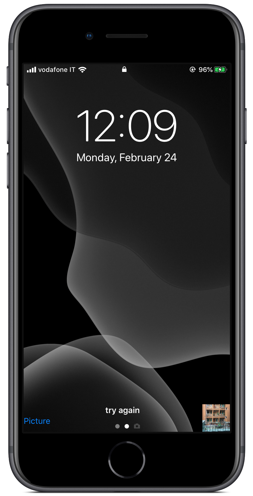

# customCameraView
A small project idea using a custom camera view for a magic app.
The idea of the project is to have a fake home screen showing up and secretly take a picture that
will be used for other purposses.
This is the current state:

